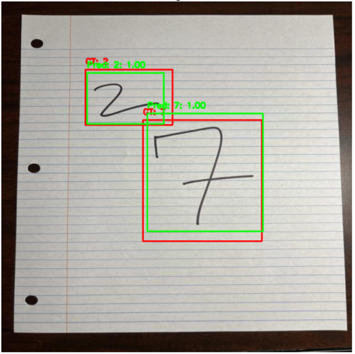
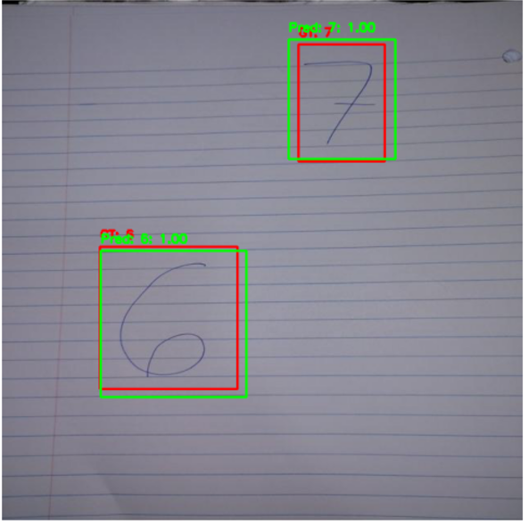
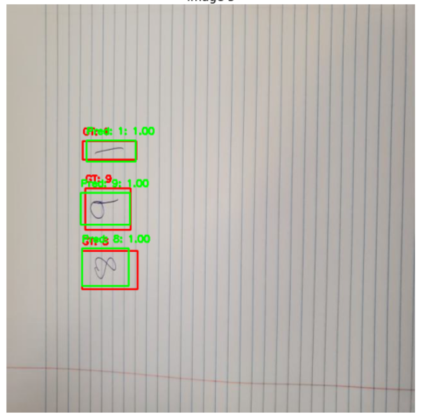

<!-- PROJECT LOGO -->
<br />
<p align="center">
  <a href="https://github.com/UF-EEL5840-EEE4773-Fall-2024/final-project-code-report-overfitting">
    
  </a>

  <h3 align="center">Overfitting</h3>

  <p align="center">
    Model designed for handwritten digit detection
    <br />
    <a href="https://github.com/UF-EEL5840-EEE4773-Fall-2024/final-project-code-report-overfitting"><strong>Explore the docs »</strong></a>
    <br />
    <br />
    <a href="#usage">View Demo</a>
  </p>
</p>

<!-- TABLE OF CONTENTS -->
<details open="open">
  <summary>Table of Contents</summary>
  <ol>
    <li>
      <a href="#about-the-project">About The Project</a>
    </li>
    <li>
      <a href="#getting-started">Getting Started</a>
      <ul>
        <li><a href="#dependencies">Dependencies</a></li>
        <li><a href="#installation">Installation</a></li>
      </ul>
    </li>
    <li><a href="#usage">Usage</a></li>
    <li><a href="#license">License</a></li>
    <li><a href="#authors">Authors</a></li>
    <li><a href="#acknowledgements">Acknowledgements</a></li>
  </ol>
</details>

<!-- ABOUT THE PROJECT -->

## About The Project

This project tackles the challenge of detecting multiple handwritten digits in a single image, a significant extension beyond traditional single-digit recognition tasks. We utilized the Faster R-CNN framework with a ResNet-50 backbone and Feature Pyramid Network (FPN) to enhance object detection capabilities. To improve the model's performance, advanced preprocessing techniques such as Contrast Limited Adaptive Histogram Equalization (CLAHE) were employed, along with augmentations from Albumentations. Training strategies focused on optimizing localization accuracy and implementing dynamic learning rate scheduling. Evaluations using Intersection over Union (IoU) showed high detection accuracy, with a mean IoU of 0.69 achieved on the validation set.

[Overfitting](https://github.com/UF-EEL5840-EEE4773-Fall-2024/final-project-code-report-overfitting)

References:

K. He, X. Zhang, S. Ren, and J. Sun, "Deep residual learning for image recognition," in Proceedings of the IEEE Conference on Computer Vision and Pattern Recognition (CVPR), Las Vegas, NV, USA, 2016, pp. 770–778.

S. Ren, K. He, R. Girshick, and J. Sun, "Faster R-CNN: Towards real-time object detection with region proposal networks," IEEE Transactions on Pattern Analysis and Machine Intelligence, vol. 39, no. 6, pp. 1137–1149, Jun. 2017.

T. Y. Lin, P. Dollár, R. Girshick, et al., "Feature pyramid networks for object detection," in Proceedings of the IEEE Conference on Computer Vision and Pattern Recognition (CVPR), Honolulu, HI, USA, 2017, pp. 2117–2125.

S. M. Pizer, et al., "Adaptive histogram equalization and its variations," Computer Vision, Graphics, and Image Processing, vol. 39, no. 3, pp. 355–368, 1987.

H. Rezatofighi, et al., "Generalized intersection over union: A metric and a loss for bounding box regression," in Proceedings of the IEEE/CVF Conference on Computer Vision and Pattern Recognition (CVPR), Long Beach, CA, USA, 2019, pp. 658–666.

A. Buslaev, et al., "Albumentations: Fast and flexible image augmentations," Information, vol. 11, no. 2, pp. 125, Feb. 2020.

PyTorch Documentation: https://pytorch.org/docs/stable/index.html

Torchvision Models: https://pytorch.org/vision/stable/models.html

Albumentations Library: https://albumentations.ai/docs/

<!-- GETTING STARTED -->

## Getting Started

To use this model, pull the repository, and use environment.yml to create a conda environment with the necessary dependencies to run the model. The exact command that must be used is "conda env create -f environment.yml" in the terminal. After downloading all necessary libraries, set the directories in train.ipynb to the train images and labels. It is important to note that the training images and labels must have the EXACT same name besides their .txt/.jpg extension since the training function uses the name of the label and image file to match them. After the model has been trained and saved as a .pth, test.ipynb can be run using the trained model. In test.ipynb you must also set the directories to your test image set and label set. Once again, the code uses names to match files so corresponding files must be named identically besides their extension. The test.ipynb notebook will output data into data/output/labels in the YOLO format. It is important to note that labels must be in the YOLO format for this code to work.
**You can find the drive link of already trained model and the train dataset in the model_link.txt file.**

The pertinent lines of code to change for making sure the files link to the images correctly are:

In train.ipynb:

```python
image_dir='data/train/images',
label_dir='data/train/labels',
```

In test.ipynb:

```python
image_dir='data/val/images',
label_dir='data/val/labels',
```

### Dependencies

Use the following conda command with our environment.yml file to download all necessary dependencies.

```sh
conda env create -f environment.yml
```

### Installation

1. Clone the repo
   ```sh
   git clone https://github.com/UF-EEL5840-EEE4773-Fall-2024/final-project-code-report-overfitting.git
   ```
2. Setup (and activate) your environment

```sh
conda env create -f environment.yml
```

<!-- USAGE EXAMPLES -->

## Usage

The following images show a few examples of the output of the code once the label files have been overlayed onto the images.

<div align="center">
  
  
  
</div>

<!-- LICENSE -->

## License

All softwares are free to use for commercial and educational purposes with proper references given.

<!-- Authors -->

## Authors

Harshit Raj - harshitraj@ufl.edu

Jay Nibhanupudy - jaynibhanupudy@ufl.edu

Teja Naga Sai Rupesh Yarramneedi - yarramneedi.t@ufl.edu

Project Link: [https://github.com/UF-EEL5840-EEE4773-Fall-2024/final-project-code-report-overfitting](https://github.com/UF-EEL5840-EEE4773-Fall-2024/final-project-code-report-overfitting)

<!-- ACKNOWLEDGEMENTS -->

## Acknowledgements

- [Catia Silva](https://faculty.eng.ufl.edu/catia-silva/)
- [PyTorch Documentation](https://pytorch.org/docs/stable/index.html)
- [Torchvision Models](https://pytorch.org/vision/stable/models.html)
- [Albumentations Library](https://albumentations.ai/docs/)

K. He, X. Zhang, S. Ren, and J. Sun, "Deep residual learning for image recognition," in Proceedings of the IEEE Conference on Computer Vision and Pattern Recognition (CVPR), Las Vegas, NV, USA, 2016, pp. 770–778.

S. Ren, K. He, R. Girshick, and J. Sun, "Faster R-CNN: Towards real-time object detection with region proposal networks," IEEE Transactions on Pattern Analysis and Machine Intelligence, vol. 39, no. 6, pp. 1137–1149, Jun. 2017.

T. Y. Lin, P. Dollár, R. Girshick, et al., "Feature pyramid networks for object detection," in Proceedings of the IEEE Conference on Computer Vision and Pattern Recognition (CVPR), Honolulu, HI, USA, 2017, pp. 2117–2125.

S. M. Pizer, et al., "Adaptive histogram equalization and its variations," Computer Vision, Graphics, and Image Processing, vol. 39, no. 3, pp. 355–368, 1987.

H. Rezatofighi, et al., "Generalized intersection over union: A metric and a loss for bounding box regression," in Proceedings of the IEEE/CVF Conference on Computer Vision and Pattern Recognition (CVPR), Long Beach, CA, USA, 2019, pp. 658–666.

A. Buslaev, et al., "Albumentations: Fast and flexible image augmentations," Information, vol. 11, no. 2, pp. 125, Feb. 2020.
